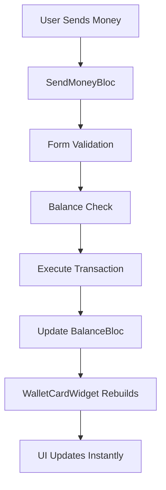
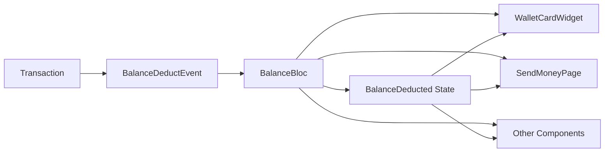

# Payora - Design Documentation

## 📋 Table of Contents
- [Overview](#overview)
- [Architecture](#architecture)
- [Design Patterns](#design-patterns)
- [State Management](#state-management)
- [Module Structure](#module-structure)
- [Key Features](#key-features)
- [Data Flow](#data-flow)
- [UI/UX Design](#uiux-design)
- [Security Considerations](#security-considerations)
- [Testing Strategy](#testing-strategy)

---

## 🎯 Overview

**Payora** is a next-generation digital wallet application built with Flutter, designed for modern financial transactions and balance management. The app follows clean architecture principles with BLoC pattern for state management, ensuring scalability, maintainability, and testability.

### Key Objectives
- 💰 **Secure Financial Management** - Safe and reliable balance tracking
- 🚀 **Real-time Updates** - Instant balance and transaction updates
- 📱 **Cross-platform** - iOS, Android, Web, and Desktop support
- 🎨 **Modern UI/UX** - Intuitive and responsive design
- 🏗️ **Scalable Architecture** - Modular and maintainable codebase

---

## 🏗️ Architecture

### Overall Architecture Pattern
The app follows **Clean Architecture** principles with clear separation of concerns:

```
┌─────────────────┐    ┌─────────────────┐    ┌─────────────────┐
│  Presentation   │    │     Domain      │    │      Data       │
│     Layer       │ ──▶│     Layer       │ ──▶│     Layer       │
└─────────────────┘    └─────────────────┘    └─────────────────┘
│                 │    │                 │    │                 │
│ • Pages         │    │ • Entities      │    │ • Repositories  │
│ • Widgets       │    │ • Use Cases     │    │ • Data Sources  │
│ • BLoCs         │    │ • Repositories  │    │ • Models        │
│ • States/Events │    │   (Interfaces)  │    │ • APIs          │
└─────────────────┘    └─────────────────┘    └─────────────────┘
```

### Layer Responsibilities

#### 🎨 **Presentation Layer**
- **Pages**: Screen-level widgets and navigation
- **Widgets**: Reusable UI components
- **BLoCs**: Business logic and state management
- **States/Events**: State definitions and user interactions

#### 🎯 **Domain Layer**
- **Entities**: Core business models
- **Use Cases**: Business logic implementation
- **Repository Interfaces**: Data access contracts

#### 💾 **Data Layer**
- **Repositories**: Data access implementation
- **Data Sources**: External API and local storage
- **Models**: Data transfer objects

---

## 🔄 Design Patterns

### 1. **BLoC Pattern (Business Logic Component)**
```dart
// Event-driven state management
class BalanceBloc extends Bloc<BalanceEvent, BalanceState> {
  BalanceBloc() : super(BalanceInitial()) {
    on<BalanceInitializeEvent>(_onInitialize);
    on<BalanceDeductEvent>(_onDeduct);
    on<BalanceAddEvent>(_onAdd);
  }
}
```

**Benefits:**
- ✅ Predictable state changes
- ✅ Testable business logic
- ✅ Reactive UI updates
- ✅ Clear separation of concerns

### 2. **Repository Pattern**
```dart
abstract class AuthRepository {
  Future<bool> login(String username, String password);
  Future<void> logout();
  Future<bool> isLoggedIn();
}
```

**Benefits:**
- ✅ Data source abstraction
- ✅ Easy testing with mocks
- ✅ Flexible data source switching
- ✅ Clean dependency injection

### 3. **Dependency Injection**
```dart
class SendMoneyDI {
  static SendMoneyBloc createBloc() {
    return SendMoneyBloc(
      SendTransactionUseCase(),
    );
  }
}
```

**Benefits:**
- ✅ Loose coupling
- ✅ Easy testing
- ✅ Configuration flexibility
- ✅ Better maintainability

---

## 🧠 State Management

### Core State Management Architecture

#### **1. LoginBloc - Authentication State**
```dart
// States
- LoginInitialState
- LoginLoadingState  
- LoginAuthenticatedState
- LoginUnauthenticatedState
- LoginErrorState

// Events
- LoginInitializeEvent
- LoginSubmitEvent
- LoginLogoutEvent
- LoginCheckAuthEvent
```

#### **2. BalanceBloc - Financial State**
```dart
// States
- BalanceInitial
- BalanceLoading
- BalanceLoaded
- BalanceUpdated
- BalanceDeducted
- BalanceAdded
- BalanceError
- BalanceInsufficientFunds

// Events
- BalanceInitializeEvent
- BalanceUpdateEvent
- BalanceDeductEvent
- BalanceAddEvent
- BalanceResetEvent
```

#### **3. SendMoneyBloc - Transaction State**
```dart
// States
- SendMoneyInitial
- SendMoneyTransactionList
- SendMoneyStatus
- SendMoneyFormCleared

// Events
- SendMoneyExecuteTransaction
- SendMoneyResetStatus
- SendMoneyClearForm
```

### **MultiStateMixin Pattern**
```dart
class BalanceBloc extends Bloc<BalanceEvent, BalanceState>
    with MultiStateMixin<BalanceEvent, BalanceState> {
  
  // Hold multiple states simultaneously
  holdState(() => const BalanceLoaded(balance: 0));
  holdState(() => const BalanceUpdated(balance: 0, previousBalance: 0));
}
```

**Benefits:**
- ✅ Multiple concurrent states
- ✅ State persistence
- ✅ Easy state access
- ✅ Complex state scenarios

---

## 📁 Module Structure

### Feature-Based Organization
```
lib/
├── core/                           # Shared utilities and configurations
│   ├── config/                     # App configuration
│   ├── constants/                  # App constants
│   ├── errors/                     # Error handling
│   ├── extensions/                 # Dart extensions
│   ├── l10n/                      # Internationalization
│   ├── mixins/                    # Reusable mixins
│   ├── navigation/                # Navigation configuration
│   ├── services/                  # Core services
│   ├── shared/
│   │   ├── bloc/                  # Shared BLoCs (BalanceBloc)
│   │   └── widgets/               # Reusable widgets
│   ├── theme/                     # App theming
│   └── utils/                     # Utility functions
├── features/                      # Feature modules
│   ├── login/                     # Authentication feature
│   │   ├── data/
│   │   ├── domain/
│   │   └── presentation/
│   │       ├── bloc/
│   │       ├── pages/
│   │       └── widgets/
│   ├── wallet/                    # Wallet management feature
│   │   └── presentation/
│   │       ├── bloc/
│   │       ├── pages/
│   │       └── widgets/
│   ├── send_money/               # Money transfer feature
│   │   ├── data/
│   │   ├── domain/
│   │   └── presentation/
│   └── profile/                  # User profile feature
└── main_*.dart                   # Environment entry points
```

### **Feature Module Structure**
Each feature follows the same pattern:
```
feature_name/
├── data/                         # Data layer
│   ├── datasources/             # API and local data sources
│   ├── models/                  # Data models
│   └── repositories/            # Repository implementations
├── domain/                      # Domain layer  
│   ├── entities/                # Business entities
│   ├── repositories/            # Repository interfaces
│   └── usecases/               # Business use cases
└── presentation/               # Presentation layer
    ├── bloc/                   # State management
    ├── pages/                  # Screen widgets
    └── widgets/                # Feature-specific widgets
```

---

## ✨ Key Features

### 1. **Balance Management System**
- 💰 **Real-time Balance Tracking**
  - Live updates across all screens
  - Automatic balance deduction on transactions
  - Balance validation for transfers

- 🔄 **State Persistence**
  - Balance state maintained across navigation
  - Automatic initialization on app start
  - Fallback to default values

### 2. **Transaction Management**
- 📱 **Send Money Flow**
  - Form validation with balance checking
  - Real-time balance display
  - Transaction confirmation
  - Automatic form clearing on success

- 📊 **Transaction History**
  - Transaction list management
  - Success/failure tracking
  - User feedback system

### 3. **Authentication System**
- 🔐 **Secure Login**
  - Credential validation
  - Session management
  - Automatic authentication checking

- 👤 **User Management**
  - Default user data
  - Profile information
  - Card number generation

### 4. **UI/UX Features**
- 🎨 **Responsive Design**
  - Adaptive layouts
  - Dark/light theme support
  - Cross-platform compatibility

- 📱 **Modern Interface**
  - Material Design 3
  - Smooth animations
  - Intuitive navigation

---

## 🔄 Data Flow

### Balance Update Flow


### State Synchronization


### Component Communication
```dart
// 1. Transaction triggered
sendMoneyBloc.add(SendMoneyExecuteTransaction(transaction));

// 2. On success, update balance
balanceBloc.add(BalanceDeductEvent(amount: transaction.amount));

// 3. WalletCardWidget automatically rebuilds
BlocBuilder<BalanceBloc, BalanceState>(
  builder: (context, state) {
    return WalletCard(balance: balanceBloc.currentBalance);
  },
)
```

---

## 🎨 UI/UX Design

### Design System
- **Color Scheme**: Primary, secondary, surface colors with proper contrast
- **Typography**: Consistent text styles and hierarchies
- **Spacing**: 8px grid system for consistent layouts
- **Components**: Reusable widgets following Material Design

### Key UI Components

#### **1. WalletCardWidget**
```dart
// Self-contained balance management
BlocBuilder<BalanceBloc, BalanceState>(
  builder: (context, state) {
    return WalletCard(
      balance: balanceBloc.currentBalance,
      visibility: toggleable,
    );
  },
)
```

#### **2. Transaction Forms**
- Real-time validation
- Balance limit display
- Error handling
- Success feedback

#### **3. Navigation System**
- Bottom navigation
- Stateful shell routes
- Deep linking support

### Responsive Design
- **Mobile**: Optimized for touch interactions
- **Tablet**: Adaptive layouts with better space utilization
- **Desktop**: Mouse and keyboard support
- **Web**: Progressive web app capabilities

---

## 🔒 Security Considerations

### Authentication Security
- ✅ **Credential Validation**: Server-side validation
- ✅ **Session Management**: Secure token handling
- ✅ **Auto-logout**: Session timeout implementation

### Data Security
- ✅ **Balance Protection**: Server-side balance validation
- ✅ **Transaction Verification**: Double-checking mechanisms
- ✅ **Input Sanitization**: XSS and injection prevention

### UI Security
- ✅ **Balance Visibility Toggle**: Privacy protection
- ✅ **Secure Navigation**: Authentication guards
- ✅ **Error Handling**: No sensitive data in error messages

---

## 🧪 Testing Strategy

### Testing Pyramid
```
┌─────────────────┐
│  Integration    │ ← E2E Testing
│     Tests       │
├─────────────────┤
│   Widget Tests  │ ← UI Component Testing
├─────────────────┤
│   Unit Tests    │ ← Business Logic Testing
└─────────────────┘
```

### TODO: Test Coverage Areas

#### **1. Unit Tests**
- BLoC logic testing
- Use case testing
- Utility function testing
- Extension method testing

#### **2. Widget Tests**
- Component rendering
- User interaction testing
- State-driven UI changes
- Navigation testing

#### **3. Integration Tests**
- Feature flow testing
- Cross-component communication
- Data persistence testing
- Authentication flows

### Testing Tools
- **flutter_test**: Core testing framework
- **bloc_test**: BLoC-specific testing
- **mocktail**: Mocking dependencies

---

## 🚀 Future Enhancements

### Planned Features
- 📊 **Analytics Dashboard**: Transaction insights and spending patterns
- 🔔 **Push Notifications**: Transaction alerts and security notifications
- 💳 **Multi-card Support**: Multiple payment methods
- 🌍 **Multi-currency**: International transaction support
- 🤖 **AI Insights**: Spending recommendations and budgeting

### Technical Improvements
- 🔄 **Offline Support**: Local transaction caching
- ⚡ **Performance Optimization**: Image caching and lazy loading
- 🔐 **Enhanced Security**: Biometric authentication
- 📱 **Accessibility**: Screen reader and keyboard navigation support

---

## 📖 Conclusion

Payora's architecture emphasizes:
- **Maintainability** through clean architecture
- **Scalability** through modular design
- **Testability** through dependency injection
- **Performance** through efficient state management
- **User Experience** through responsive design

The combination of Flutter's cross-platform capabilities and BLoC's predictable state management creates a robust foundation for a modern financial application.

---

*This documentation serves as a living guide for the Payora development team and will be updated as the application evolves.*
