# Payora - Design Documentation

*Next-gen wallet for next-gen living*

## 📋 Table of Contents

1. [Project Overview](#-project-overview)
2. [Architecture](#-architecture)
3. [Class Diagrams](#-class-diagrams)
4. [Sequence Diagrams](#-sequence-diagrams)
5. [State Management](#-state-management)
6. [Data Flow](#-data-flow)
7. [Technology Stack](#-technology-stack)
8. [Security](#-security)

---

## 🚀 Project Overview

**Payora** is a modern Flutter-based digital wallet application designed with clean architecture principles, featuring secure money transfers, transaction history, and user profile management.

### **Key Features**
- 🔐 **Secure Authentication** with session management
- 💰 **Wallet Management** with balance visibility controls
- 💸 **Money Transfer** with real-time validation
- 📊 **Transaction History** with detailed views
- 👤 **Profile Management** with logout functionality
- 🎨 **Modern UI/UX** with Material Design 3

### **Project Structure**
```
lib/
├── core/                    # Shared infrastructure
│   ├── base/               # Base classes and interfaces
│   ├── di/                 # Dependency injection
│   ├── extensions/         # Dart extensions
│   ├── l10n/              # Internationalization
│   ├── mixins/            # Reusable mixins
│   ├── router/            # Navigation configuration
│   ├── shared/            # Shared components
│   ├── theme/             # App theming
│   └── utils/             # Utilities
├── features/              # Feature modules
│   ├── login/             # Authentication
│   ├── wallet/            # Wallet management
│   ├── transaction/       # Transaction handling
│   ├── send_money/        # Money transfer
│   └── profile/           # User profile
└── app.dart              # Main application
```

---

## 🏗️ Architecture

### **Feature-based Pattern**
Each feature follows the same architectural pattern:

```
feature/
├── data/
│   ├── datasources/     # API and local data sources
│   ├── models/          # Data models with JSON serialization
│   └── repositories/    # Repository implementations
├── domain/
│   ├── entities/        # Business objects
│   ├── repositories/    # Repository interfaces
│   └── usecases/        # Business logic
└── presentation/
    ├── bloc/            # State management
    ├── pages/           # UI screens
    └── widgets/         # Feature-specific widgets
```

---

## 📊 Class Diagrams

### **1. Authentication Module**

```mermaid
classDiagram
    class User {
        +int id
        +String username
        +String password
        +Details details
    }
    
    class Details {
        +String firstname
        +String lastname
        +double balance
        +String mobile
        +String fullName
    }
    
    class AuthBloc {
        +AuthLoginUsecase loginUsecase
        +AuthLogoutUsecase logoutUsecase
        +AuthSaveUserUsecase saveUserUsecase
        +AuthGetUserUsecase getUserUsecase
        +executeLogin()
        +executeLogout()
        +checkSession()
    }
    
    class AuthRepository {
        <<interface>>
        +login(username, password) User
        +logout() void
        +getUser() User
        +saveUser(user) void
    }
    
    class AuthRepositoryImpl {
        +AuthDataSource dataSource
        +login(username, password) User
        +logout() void
        +getUser() User
        +saveUser(user) void
    }
    
    class AuthDataSource {
        <<interface>>
        +login(username, password) UserModel
        +logout() void
        +getUser() UserModel
        +saveUser(user) void
    }
    
    class AuthDataSourceImpl {
        +SharedPreferences prefs
        +login(username, password) UserModel
        +logout() void
        +getUser() UserModel
        +saveUser(user) void
    }
    
    User ||--|| Details
    AuthBloc --> AuthRepository
    AuthRepositoryImpl ..|> AuthRepository
    AuthRepositoryImpl --> AuthDataSource
    AuthDataSourceImpl ..|> AuthDataSource
```

### **2. Transaction Module**

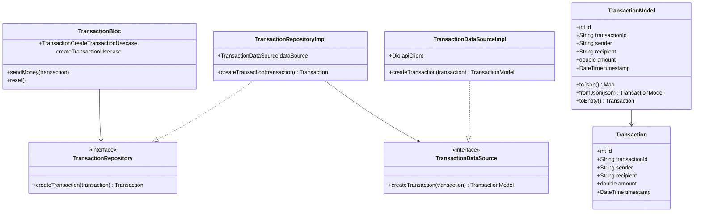

### **3. Wallet Module**

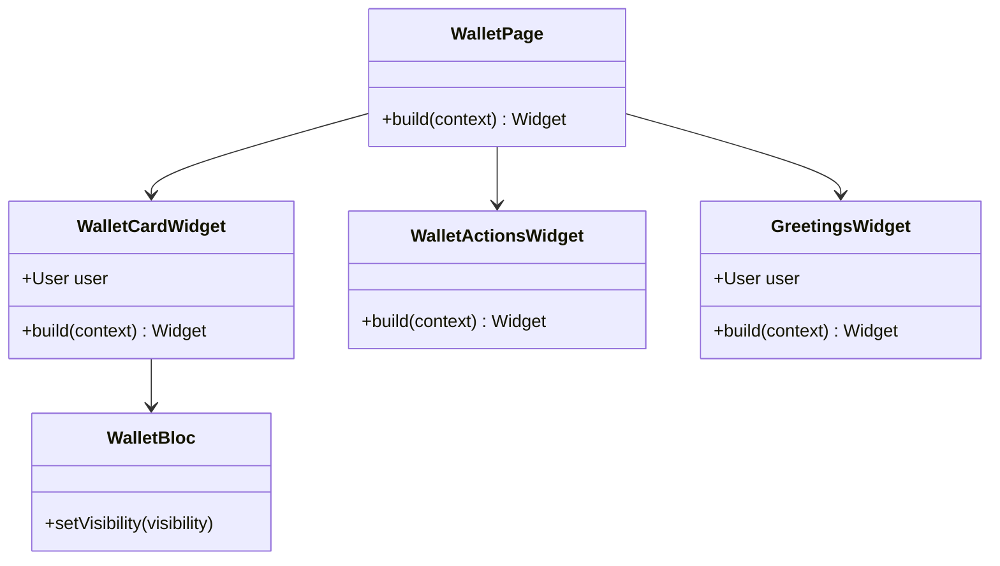

### **4. Core Infrastructure**

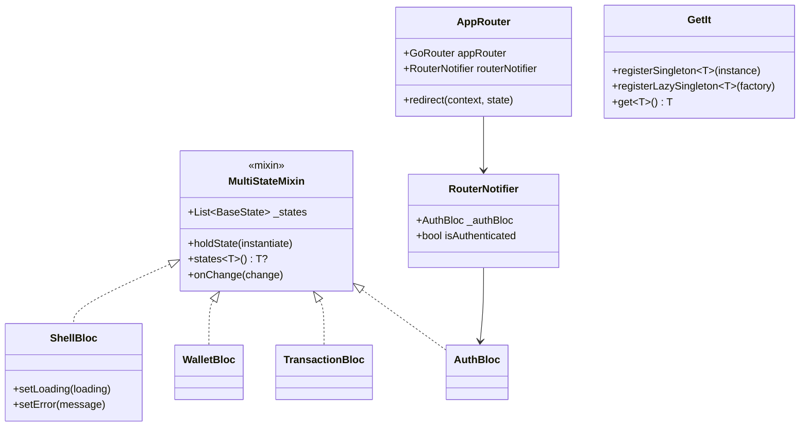

---

## 🔄 Sequence Diagrams

### **1. User Login Flow**

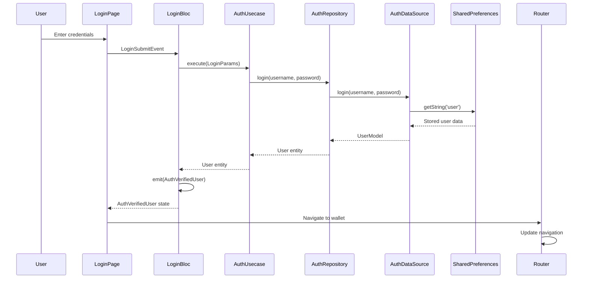

### **2. Send Money Transaction Flow**

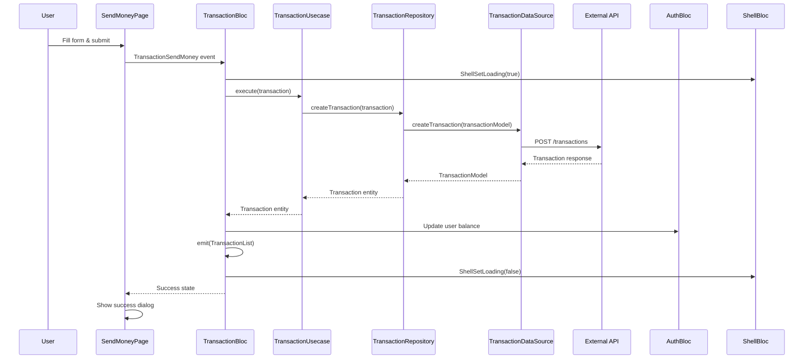

### **3. Wallet Balance Visibility Toggle**

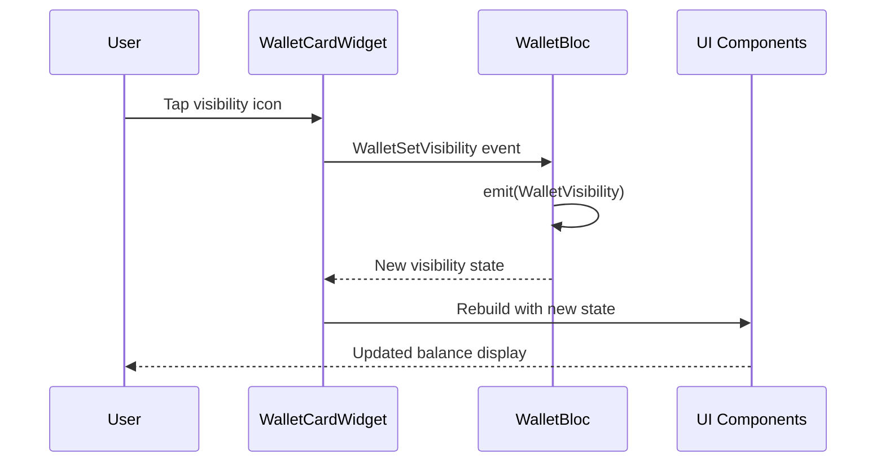

### **4. App Startup & Session Check**

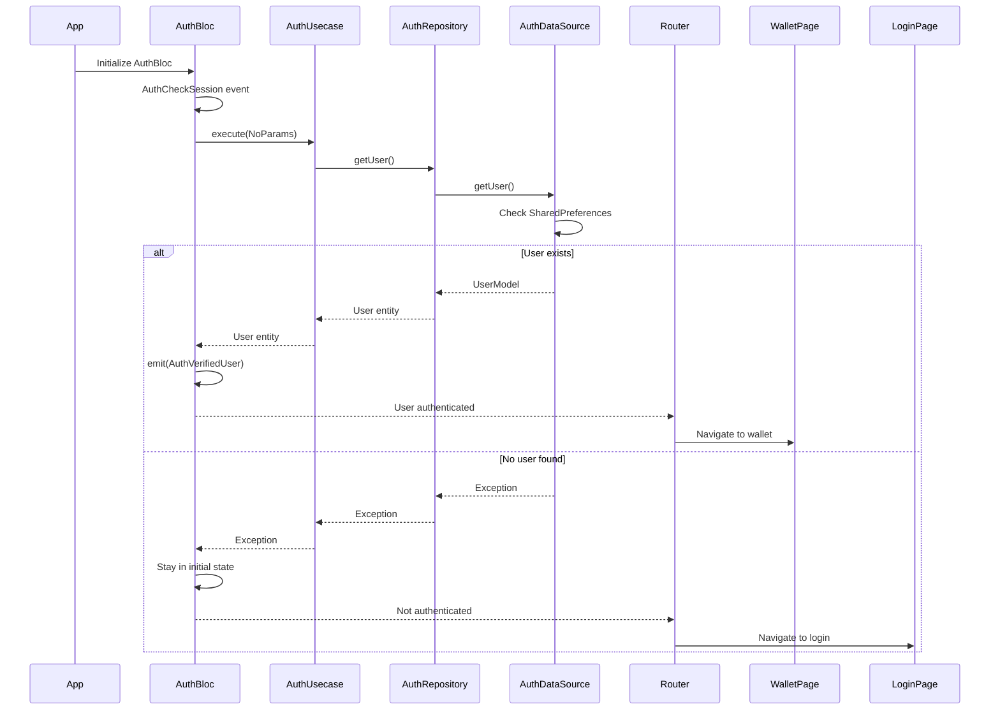

### **5. Logout Flow**

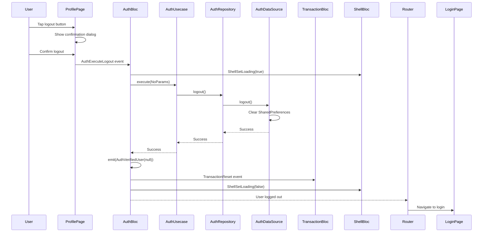

---

## 🧠 State Management

### **BLoC Pattern Architecture**

The app uses the **BLoC (Business Logic Component)** pattern with a custom **MultiStateMixin** for advanced state management.

#### **Core BLoCs**

```dart
// 1. AuthBloc - Authentication & User Management
sealed class AuthState extends Equatable {}
class AuthInitial extends AuthState {}
class AuthLoading extends AuthState {
  final bool loading;
}
class AuthVerifiedUser extends AuthState {
  final User? user;
}
class AuthError extends AuthState {
  final String message;
}

// 2. TransactionBloc - Transaction Management
sealed class TransactionState extends Equatable {}
class TransactionInitial extends TransactionState {}
class TransactionList extends TransactionState {
  final List<Transaction> transactions;
}
class TransactionError extends TransactionState {
  final String message;
}

// 3. WalletBloc - Wallet UI State
sealed class WalletState extends Equatable {}
class WalletInitial extends WalletState {}
class WalletVisibility extends WalletState {
  final bool visibility;
}

// 4. ShellBloc - Global App State
sealed class ShellState extends Equatable {}
class ShellInitial extends ShellState {}
class ShellLoading extends ShellState {
  final bool loading;
}
class ShellError extends ShellState {
  final String message;
}
```

#### **MultiStateMixin Pattern**

```dart
mixin MultiStateMixin<BaseEvent, BaseState> on Bloc<BaseEvent, BaseState> {
  final List<BaseState> _states = [];
  
  // Hold multiple states simultaneously
  void holdState(BaseState Function() instantiate) {
    final instance = instantiate.call();
    final reference = _findStateInstance(instance);
    
    if (reference != null) {
      final index = _states.indexOf(reference);
      _states[index] = instance;
    } else {
      _states.add(instance);
    }
  }
  
  // Retrieve specific state type
  ConcreteState? states<ConcreteState extends BaseState>() =>
      _findStateByType<ConcreteState>();
}
```

**Benefits:**
- ✅ Multiple concurrent states
- ✅ State persistence across events
- ✅ Easy cross-BLoC communication
- ✅ Complex state scenarios support

---

## 🔄 Data Flow

### **1. State Synchronization**

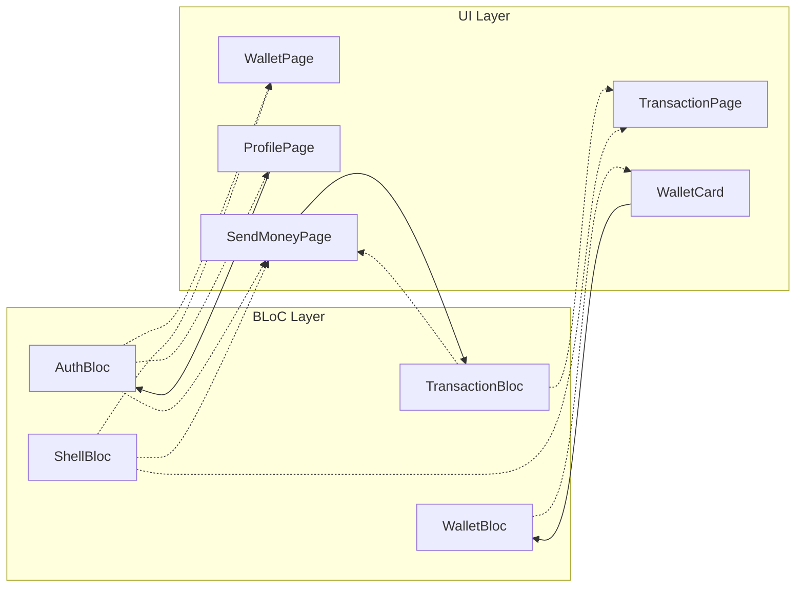

### **2. Transaction Data Flow**

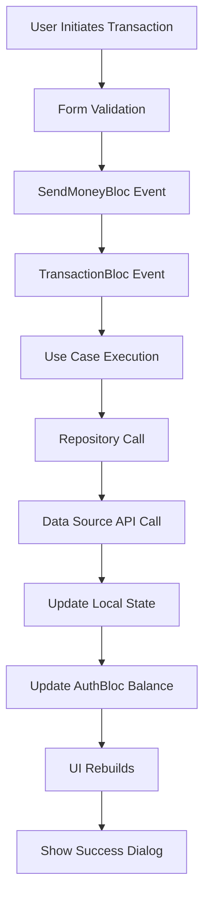

### **3. Authentication Flow**

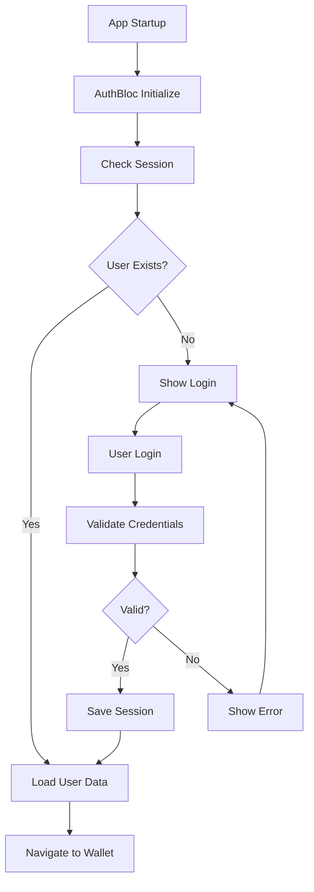

---

## 💻 Technology Stack

### **Frontend Framework**
- **Flutter 3.32+** - Cross-platform UI framework
- **Dart 3.8+** - Programming language

### **State Management**
- **flutter_bloc 9.1.1** - BLoC pattern implementation
- **bloc_concurrency 0.3.0** - Event handling optimization
- **equatable 2.0.7** - Value equality comparisons

### **Navigation**
- **go_router 16.0.0** - Declarative routing
- **Authentication guards** - Route protection

### **Dependency Injection**
- **get_it 8.2.0** - Service locator pattern
- **Lazy singletons** - Memory optimization

### **UI/UX**
- **Material Design 3** - Design system
- **google_fonts 6.3.0** - Typography
- **Custom theming** - Brand consistency

### **Data Persistence**
- **shared_preferences 2.5.3** - Local key-value storage
- **Future: SQLite** - Structured data storage

### **HTTP Client**
- **dio 5.8.0+1** - HTTP client with interceptors
- **Custom error handling** - Network resilience

### **Form Handling**
- **flutter_form_builder 10.1.0** - Form management
- **form_builder_validators 11.2.0** - Input validation

### **Internationalization**
- **flutter_localizations** - Multi-language support
- **intl 0.20.2** - Date/number formatting

### **Development Tools**
- **very_good_analysis 9.0.0** - Code quality
- **bloc_test 10.0.0** - BLoC testing
- **mocktail 1.0.4** - Mocking framework

---

## 🔒 Security

### **Authentication Security**
- ✅ **Credential Validation**: Local validation against default user
- ✅ **Session Management**: Secure token storage
- ✅ **Auto-logout**: Automatic session cleanup
- ✅ **Route Guards**: Authentication-based navigation

### **Data Security**
- ✅ **Balance Protection**: Server-side validation (future)
- ✅ **Transaction Verification**: Double-checking mechanisms
- ✅ **Input Sanitization**: Form validation and sanitization
- ✅ **Secure Storage**: Encrypted local storage (future)

### **UI Security**
- ✅ **Balance Visibility Toggle**: Privacy protection
- ✅ **Secure Navigation**: Authentication guards
- ✅ **Error Handling**: No sensitive data in error messages
- ✅ **Loading States**: User feedback and security

### **Network Security** (Future)
- 🔄 **Certificate Pinning**: Man-in-the-middle protection
- 🔄 **Request Signing**: API request authentication
- 🔄 **Rate Limiting**: DDoS protection
- 🔄 **HTTPS Only**: Encrypted communication

---

## 📈 Future Enhancements

### **Technical Improvements**
- 🔄 **Real API Integration** with backend services
- 🔄 **Offline Support** with local caching
- 🔄 **Push Notifications** for transaction updates
- 🔄 **Biometric Authentication** for enhanced security

### **Feature Expansions**
- 🔄 **Multi-currency Support** 
- 🔄 **Transaction Categories**
- 🔄 **Spending Analytics**
- 🔄 **QR Code Payments**

### **Performance Optimizations**
- 🔄 **Code Splitting** for faster load times
- 🔄 **Image Optimization** and caching
- 🔄 **Bundle Size Reduction**
- 🔄 **Memory Management** improvements

---

*This design documentation reflects the current state of the Payora application and serves as a blueprint for future development and maintenance.*
